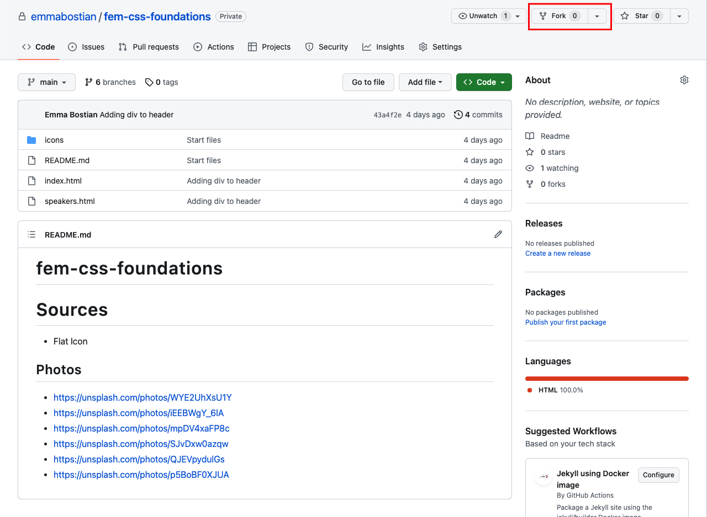
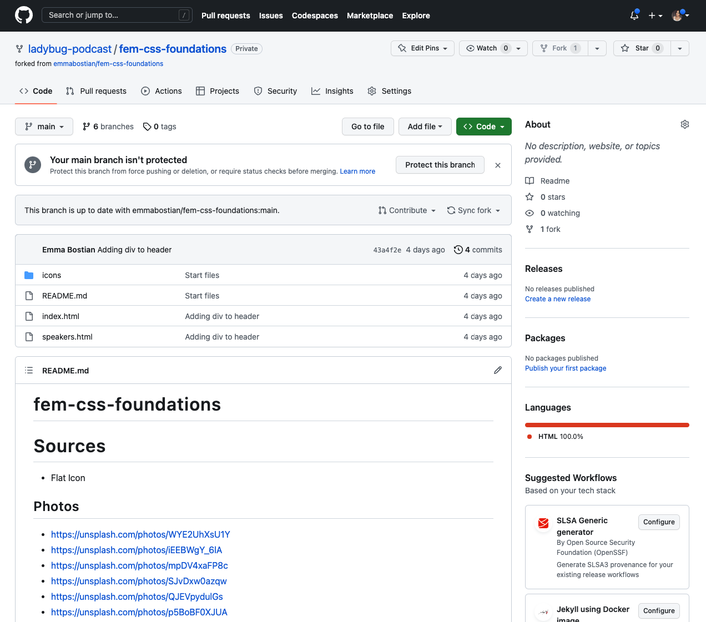
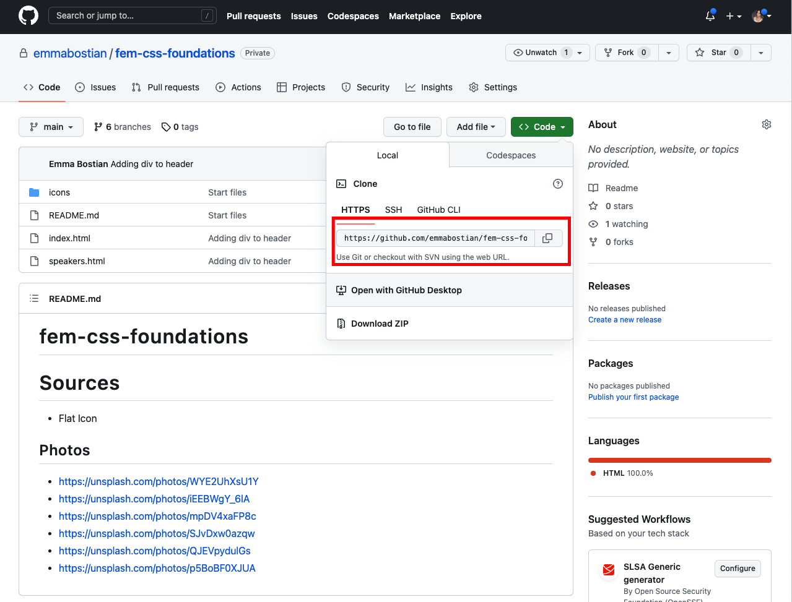
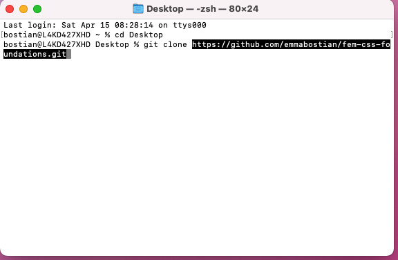
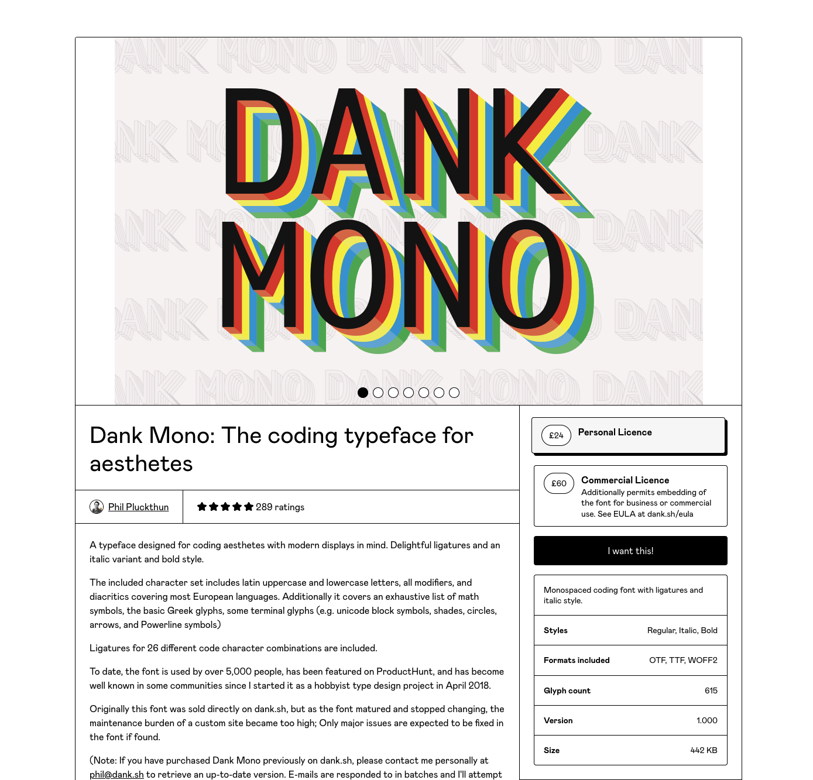
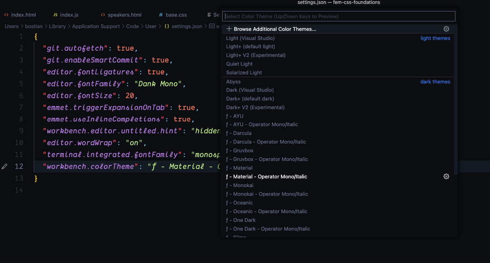
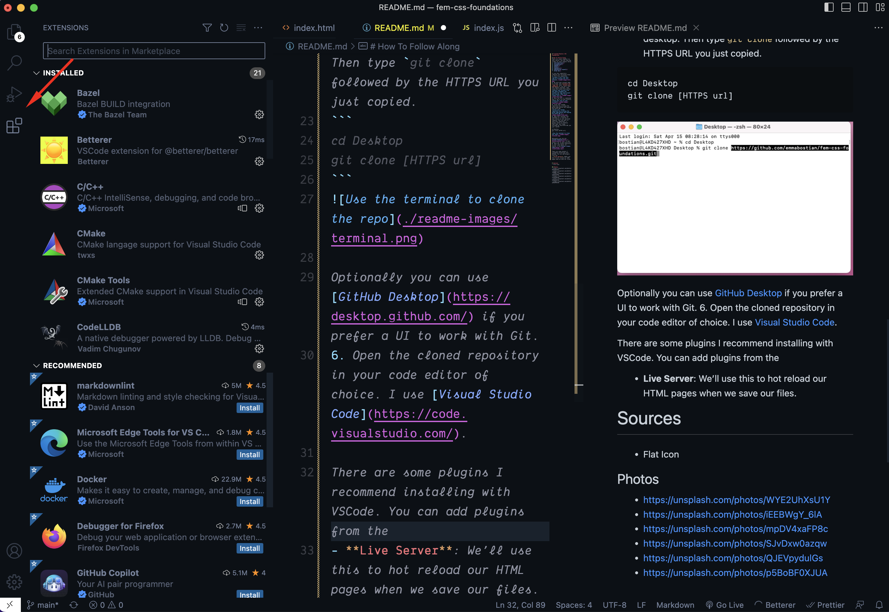
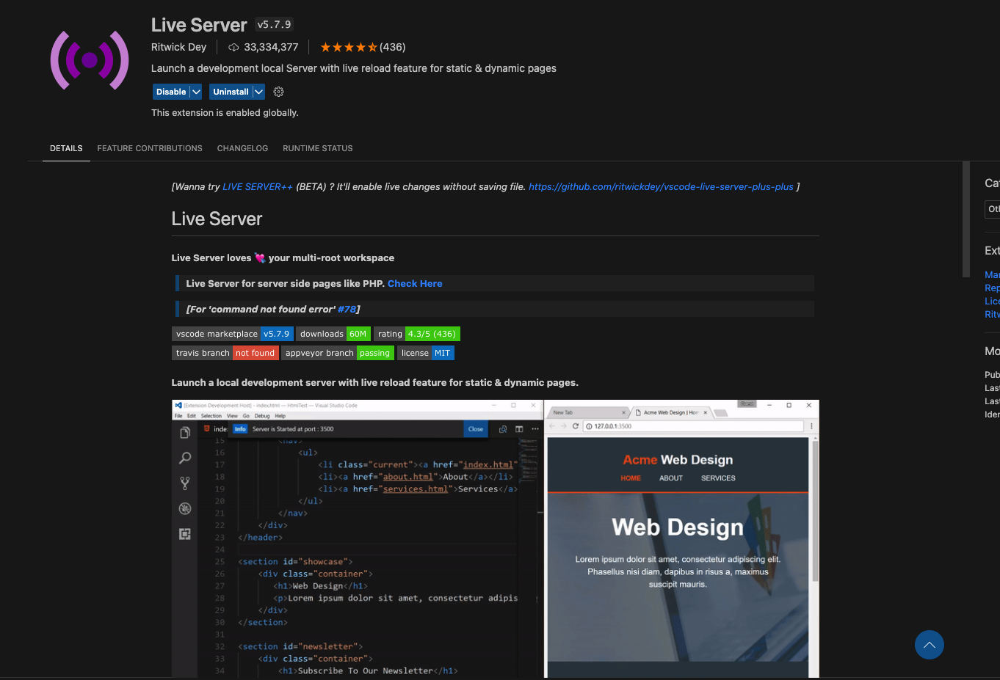
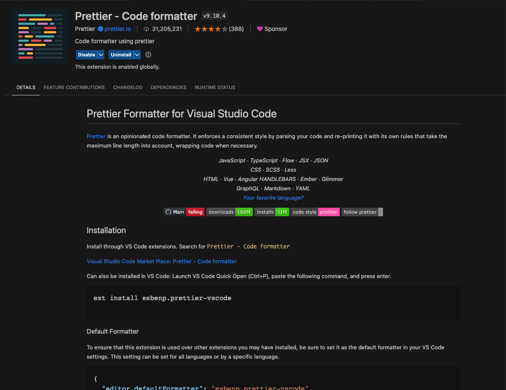
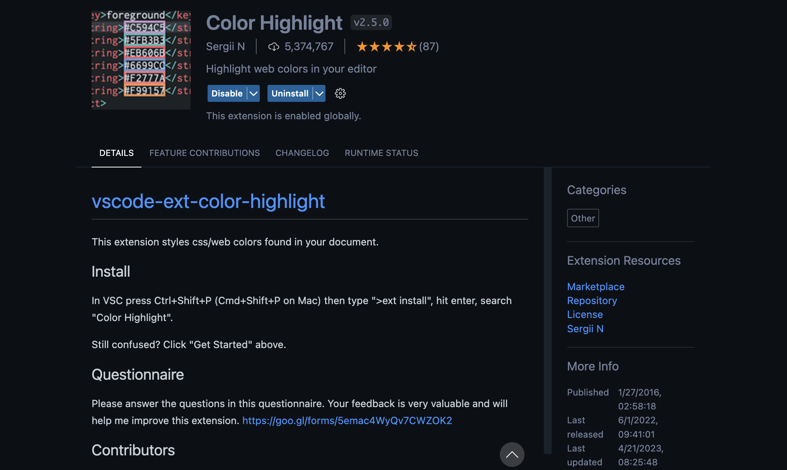

# Frontend Masters CSS Foundations
Welcome to Frontend Masters CSS Foundations! You can find the course information [here](https://frontendmasters.com/workshops/css-foundations/).

# How To Follow Along
There are seven chapters to this course. You can find the slides for each chapter below.
1. [Introduction](https://www.canva.com/design/DAFghYPw8XE/H5EI4SQBmto-AMZY3lTFlQ/edit?utm_content=DAFghYPw8XE&utm_campaign=designshare&utm_medium=link2&utm_source=sharebutton)
2. [Foundation](https://www.canva.com/design/DAFgtiBCGlU/VfPruNY7keHZc0kYY3EW2w/edit?utm_content=DAFgtiBCGlU&utm_campaign=designshare&utm_medium=link2&utm_source=sharebutton)
3. [Header](https://www.canva.com/design/DAFg530J10U/yixNmSLsJK3ed6nW0MHRGw/edit?utm_content=DAFg530J10U&utm_campaign=designshare&utm_medium=link2&utm_source=sharebutton)
4. [Home](https://www.canva.com/design/DAFiZoqdHqA/MlTAfqGejFEynXlEMZAL-Q/edit?utm_content=DAFiZoqdHqA&utm_campaign=designshare&utm_medium=link2&utm_source=sharebutton)
5. [Speakers](https://www.canva.com/design/DAFiZmzQc1s/i7fpUWL0Bp5cjxGJ5blWKg/edit?utm_content=DAFiZmzQc1s&utm_campaign=designshare&utm_medium=link2&utm_source=sharebutton)
6. [Responsive Layout](https://www.canva.com/design/DAFiZl_lCw0/Jv-d1Iu3aT0tHA1rxrlmGA/edit?utm_content=DAFiZl_lCw0&utm_campaign=designshare&utm_medium=link2&utm_source=sharebutton)
7. [Wrap Up](https://www.canva.com/design/DAFkqxyyPn0/Dz_0tKMdv-8h30LFkTunZQ/edit?utm_content=DAFkqxyyPn0&utm_campaign=designshare&utm_medium=link2&utm_source=sharebutton)

To use this repository, complete the following steps:
1. Fork this repository

2. Be sure your account name is listed, and **uncheck the 'Copy the `main` branch only' checkbox** or you won't fork the chapter branches. Then click the Create Fork button.

3. Once the fork is completed you'll see it on your profile.

4. Clone your forked repository by clicking the green Code button and copying the HTTPS URL.

5. Open your terminal and navigate to a location of your choice on your personal computer that you want to save this repository. I always select my desktop. Then type `git clone` followed by the HTTPS URL you just copied.
```
cd Desktop
git clone [HTTPS url]
```


Optionally you can use [GitHub Desktop](https://desktop.github.com/) if you prefer a UI to work with Git.  
6. Open the cloned repository in your code editor of choice. I use [Visual Studio Code](https://code.visualstudio.com/).  
7. Once you have the GitHub repository forked and cloned, you should start on the main branch. I recommend writing all of your code on the main branch, however if you get stuck or lost, each branch corresponds to the final state after the completed chapter. The branch order is as follows:
```
main
 |_ foundation
    |_header
		|_ home
			|_ speakers
                |_ responsive-layout
```
To check out a new branch run `git checkout [branch-name]` (i.e. `git checkout home`)

## Editor Settings
Below are the visual settings I use in my code editor.
- **Font**: I’m using the font [Dank Mono](https://philpl.gumroad.com/l/dank-mono) with font ligatures. It’s a paid font for 24 GBP. I also recommend [Fira Code](https://github.com/tonsky/FiraCode) which is free.


- **Theme**: I’m using the  Material - Operator Mono/Italic theme.

- **Plugins**: There are some plugins I recommend installing with VSCode. You can add plugins from the Extensions Marketplace tab in the left navigation.

- **Live Server**: Hot reloads HTML pages when we save files.

- **Prettier**:Formats our code when we save our files.

- **Color Highlight**: Styles CSS colors.


To get Prettier to work properly I had to add a few configurations in my `settings.json` file. To open this file press `command + p` on Mac, and enter `Preferences: Open Workplace Settings (JSON)`. Enter the following in the `settings.json` file and save.

```json
{
    "editor.formatOnSave": true,
    "editor.formatOnPaste": true,
    "editor.formatOnType": true,
    "editor.defaultFormatter": "esbenp.prettier-vscode",
    "[html]": {
        "editor.defaultFormatter": "vscode.html-language-features"
    }
}
```

# Sources
- Flat Icon

## Photos
- https://unsplash.com/photos/WYE2UhXsU1Y
- https://unsplash.com/photos/iEEBWgY_6lA
- https://unsplash.com/photos/mpDV4xaFP8c
- https://unsplash.com/photos/SJvDxw0azqw
- https://unsplash.com/photos/QJEVpydulGs
- https://unsplash.com/photos/p5BoBF0XJUA
